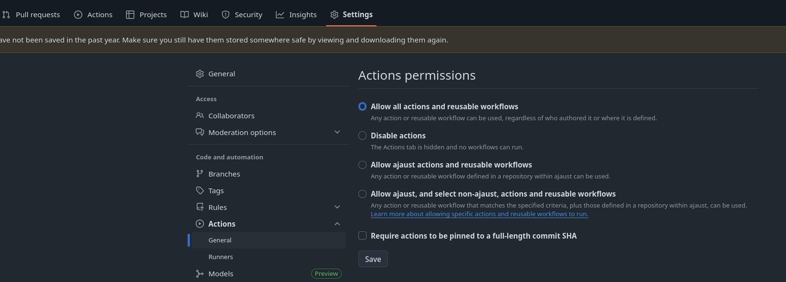

# GitHub Actions 101

This repository contains the content used for a introductionary workshop about
GitHub Actions. The intendent workshop length is 45-60 minutes. The idea of the
workshop is that the instructor goes through the repository and steps required
in a live session such that students could potentially follow along. This also
repends a bit on whether one wants to allow for questions during the tutorial
Please be aware that GitHub Actions are actively developed by GitHub and this
workshop may be out of date.

The `notes.md` file in this repository contains the lecturer's notes. If you
want to follow along during the workshop, but get lost or want to see a command
again, check if it is available in the `notes.md`.

Last updated: November 2025

## Requirements

In order to follow the steps of this workshop you need

-   A GitHub account
-   Enough credits/minutes for workflows to run. The amount of workflow minutes
    needed for this workshop is low.
-   A copy or fork of this repository.

Note: After forking the repository, ensure that Actions are enabled

GitHub might disable the Actions on forks for improved security.

You can then work on your fork/copy via a local clone on you pc or by using a
GitHub Codespace. The repository contains a devcontainer configuration such
that you can start a codespace directly from this repository.

## Learning Goals

-   You are able to add workflows to a Git repository.
-   You are able to inspect the results of a workflow.
-   You know some common, useful actions provided by GitHub.
-   You know where to look for more information about GitHub workflows.

## Checkpoints

-   `main` branch: Contains the starting point
-   `solution` branch: Contains the repository in its intended final state

## Useful links and further topics

-   [Official GitHub Actions documentation](docs.github.com/en/actions)
-   [GitHub Marketplace (filter set to "Actions"](https://github.com/marketplace?type=actions)
-   [Security in Actions](https://docs.github.com/en/actions/concepts/security/)
    -   [Secure use](https://docs.github.com/en/actions/reference/security/secure-use)
    -   [GITHUB_TOKEN in
    workflows](https://docs.github.com/en/actions/tutorials/authenticate-with-github_token)
    -   [Permissions
        overview](https://docs.github.com/en/authentication/keeping-your-account-and-data-secure/managing-your-personal-access-tokens#account-permissions)
    -   [Security how tos](https://docs.github.com/en/actions/how-tos/secure-your-work)
-   [Billing and usage](https://docs.github.com/en/actions/concepts/billing-and-usage)
-   [Docker containers in Actions](https://docs.github.com/en/actions/tutorials/use-containerized-services/create-a-docker-container-action)
-   `actionlint` linter
    -   [Repository](https://github.com/rhysd/actionlint)
    -   [Playground](https://rhysd.github.io/actionlint/)

## License

This work is licensed under a
[Creative Commons Attribution 4.0 International License][cc-by].

[![CC BY 4.0][cc-by-image]][cc-by]

[cc-by]: http://creativecommons.org/licenses/by/4.0/
[cc-by-image]: https://i.creativecommons.org/l/by/4.0/88x31.png
[cc-by-shield]: https://img.shields.io/badge/License-CC%20BY%204.0-blue.svg
